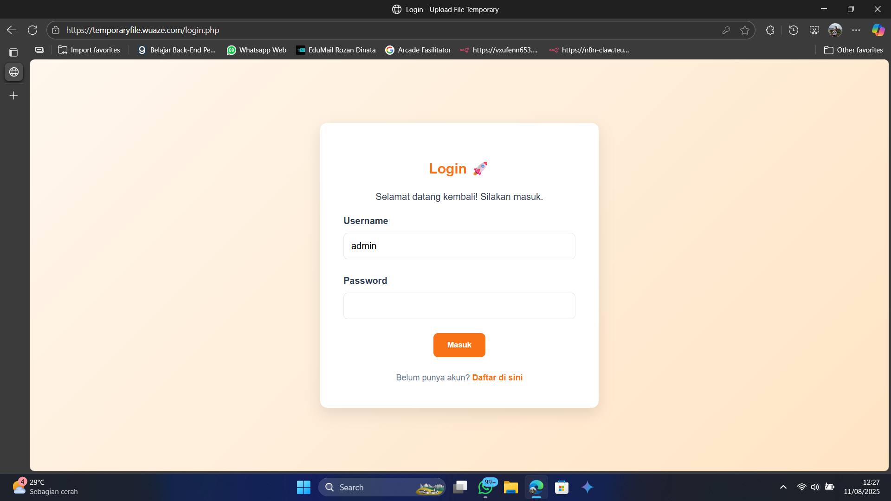
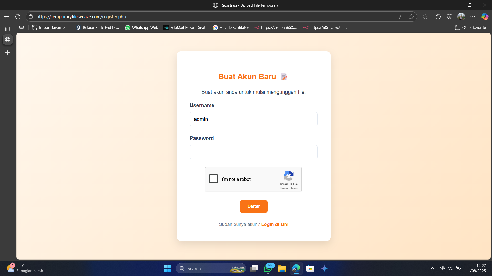
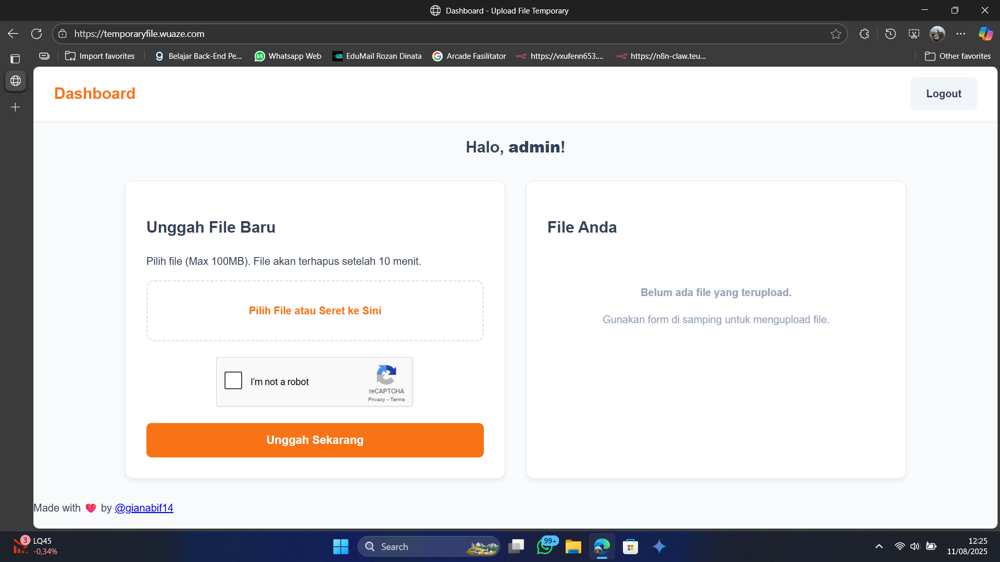

# 📂 Web Temporary Files

Aplikasi web sederhana berbasis PHP untuk mengunggah file sementara. Setiap file yang diunggah akan otomatis terhapus setelah periode waktu yang ditentukan (10 menit) dan dilindungi sehingga hanya pemilik file yang dapat mengaksesnya.

[](https://www.gnu.org/licenses/gpl-3.0)

---

## 📸 Tampilan Aplikasi

<table>
  <tr>
    <td align="center"><strong>Halaman Login</strong></td>
    <td align="center"><strong>Halaman Registrasi</strong></td>
  </tr>
  <tr>
    <td align="center">
      
    </td>
    <td align="center">
      
    </td>
  </tr>
  <tr>
    <td colspan="2" align="center"><strong>Dasbor Utama Pengguna</strong></td>
  </tr>
  <tr>
    <td colspan="2" align="center">
      
    </td>
  </tr>
</table>

---

## ✨ Fitur Utama

- **Sistem Multi-User**: Pengguna dapat mendaftar dan login ke akun pribadi mereka.
- **Upload Multi-File**: Mendukung pengunggahan beberapa file sekaligus dengan fungsionalitas *drag-and-drop*.
- **Keamanan Akses File**: File yang diunggah hanya dapat diakses atau diunduh oleh pengguna yang mengunggahnya. Akses melalui URL langsung diblokir.
- **Kedaluwarsa Otomatis**: Setiap file akan secara otomatis dihapus dari server setelah 10 menit menggunakan Cron Job.
- **Hapus Manual**: Pengguna dapat menghapus file mereka sendiri sebelum waktu kedaluwarsa habis.
- **Keamanan Formulir**: Dilengkapi dengan **Google reCAPTCHA v2** pada halaman registrasi dan form upload untuk mencegah spam dari bot.
- **Tata Letak Responsif**: Tampilan modern dengan dua kolom pada layar desktop yang akan otomatis menjadi satu kolom pada perangkat mobile.
- **Pola Desain Modern**: Mengimplementasikan pola **Post-Redirect-Get (PRG)** untuk mencegah unggahan ganda saat halaman di-refresh.

---

## 🛠️ Teknologi yang Digunakan

- **Backend**: PHP 8.x
- **Web Server**: Nginx
- **Database**: MySQL
- **Frontend**: HTML5, CSS3, Vanilla JavaScript

---

## 🚀 Tata Cara Penggunaan & Instalasi

Berikut adalah langkah-langkah untuk menjalankan proyek ini di server Anda sendiri (misalnya, VPS dengan Ubuntu/Debian).

### 1. Prasyarat
- Server dengan Nginx, PHP (v7.4+), dan MySQL/MariaDB.
- Ekstensi PHP yang dibutuhkan: `php-mysql`, `php-gd`, `php-fileinfo`.
- Akses ke terminal/SSH.
- Kunci API dari [Google reCAPTCHA](https://www.google.com/recaptcha/admin/create).

### 2. Clone Repositori
Clone repositori ini ke dalam direktori web Anda.

```bash
git clone https://github.com/gianabif14/web-temporary-files
cd web-temporary-files
```

### 3. Pengaturan Database
Buat database dan user baru di MySQL.

```bash
-- Masuk ke MySQL sebagai root
mysql -u root -p

-- Jalankan perintah berikut
CREATE DATABASE (NAMA_DATABASE);
USE (NAMA_DATABASE);

-- Buat tabel users
CREATE TABLE users (
    id INT AUTO_INCREMENT PRIMARY KEY,
    username VARCHAR(50) NOT NULL UNIQUE,
    password_hash VARCHAR(255) NOT NULL,
    created_at TIMESTAMP DEFAULT CURRENT_TIMESTAMP
);

-- Buat tabel files
CREATE TABLE files (
    id INT AUTO_INCREMENT PRIMARY KEY,
    user_id INT NOT NULL,
    unique_name VARCHAR(255) NOT NULL,
    original_name VARCHAR(255) NOT NULL,
    upload_time INT UNSIGNED NOT NULL,
    FOREIGN KEY (user_id) REFERENCES users(id) ON DELETE CASCADE
);

EXIT;
```
### 4. Konfigurasi Aplikasi
Buka file `config.php` dan sesuaikan isinya dengan informasi database dan kunci reCAPTCHA Anda. Dapatkan kunci reCAPTCHA dari [Google reCAPTCHA Admin Console](https://www.google.com/recaptcha/admin/create).

```php
// config.php

// Ganti password database sesuai yang Anda buat
define('DB_PASS', 'PASSWORD_RAHASIA_ANDA');

// Masukkan kunci Google reCAPTCHA Anda di sini
define('RECAPTCHA_SITE_KEY', 'KUNCI_SITUS_RECAPTCHA_ANDA');
define('RECAPTCHA_SECRET_KEY', 'KUNCI_RAHASIA_RECAPTCHA_ANDA');
```
### 5. Pengaturan Nginx
Konfigurasikan Nginx untuk melayani situs Anda dan mengamankan folder `uploads`. Buat atau ubah file konfigurasi server block Anda.

```nginx
# Contoh: /etc/nginx/sites-available/domain-anda.conf

server {
    listen 80;
    listen 443 ssl http2; # Aktifkan jika Anda menggunakan SSL
    server_name domain-anda.com;
    root /var/www/html/web-temporary-files; # Sesuaikan dengan path Anda
    index index.php index.html;

    # Blokir akses langsung ke folder uploads untuk keamanan
    location /uploads/ {
        deny all;
        return 404;
    }

    # Aturan untuk memproses file PHP
    location ~ \.php$ {
        include snippets/fastcgi-php.conf;
        fastcgi_pass unix:/run/php/php8.3-fpm.sock; # Sesuaikan dengan versi PHP Anda
    }

    # Aturan routing umum
    location / {
        try_files $uri $uri/ /index.php?$query_string;
    }
}
```
### 6. Atur Cron Job
Skrip `cleanup.php` harus dijalankan secara berkala untuk menghapus file yang kedaluwarsa.

1. Buka editor crontab:
   ```bash
   crontab -e
   * * * * * /usr/bin/php /var/www/html/web-temporary-files/cleanup.php >> /dev/null 2>&1
   ```
2. Tambahkan baris berikut di paling bawah untuk menjalankannya setiap menit:
   ```
   * * * * * /usr/bin/php /var/www/html/web-temporary-files/cleanup.php >> /dev/null 2>&1
   ```
Tentu, ini adalah bagian akhir dari file README.md yang bisa langsung Anda salin-tempel.

Markdown

### 6. Atur Cron Job
Skrip `cleanup.php` harus dijalankan secara berkala untuk menghapus file yang kedaluwarsa.

1. Buka editor crontab:
   ```bash
   crontab -e
   ```
2. Tambahkan baris berikut di paling bawah untuk menjalankannya setiap menit:
   ```bash
   * * * * * /usr/bin/php /var/www/html/web-temporary-files/cleanup.php >> /dev/null 2>&1
   ```
   Penting: Pastikan path di atas adalah path absolut ke file cleanup.php di server Anda.
   
### 7. Atur Izin Folder
Pastikan server web (biasanya user www-data) memiliki izin untuk menulis ke folder uploads.
```bash
sudo chown -R www-data:www-data /var/www/html/web-temporary-files
sudo chmod -R 755 /var/www/html/web-temporary-files
Setelah semua langkah ini, aplikasi Anda seharusnya sudah berjalan dengan baik.
```
### 📜 Lisensi
Proyek ini dilisensikan di bawah GNU General Public License v3.0. Lihat file `LICENSE` untuk detail lengkap.

### ❤️ Ucapan Terima Kasih
Dibuat oleh @gianabif14.

Beberapa bagian dari pemecahan masalah, pembuatan README.md, dan penyempurnaan dibantu oleh Google Gemini.
